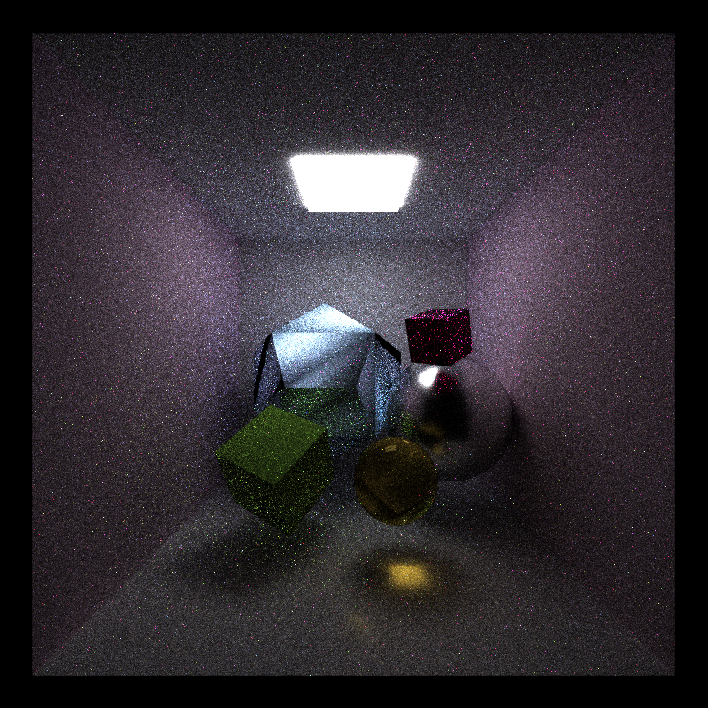
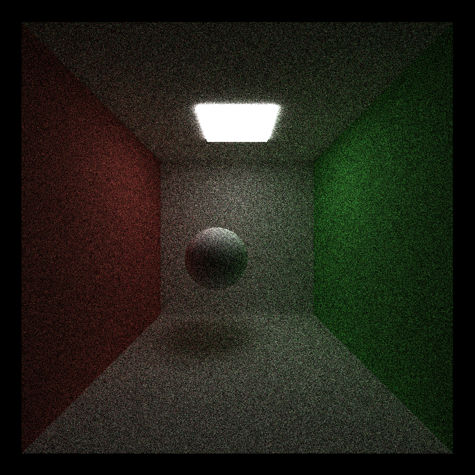
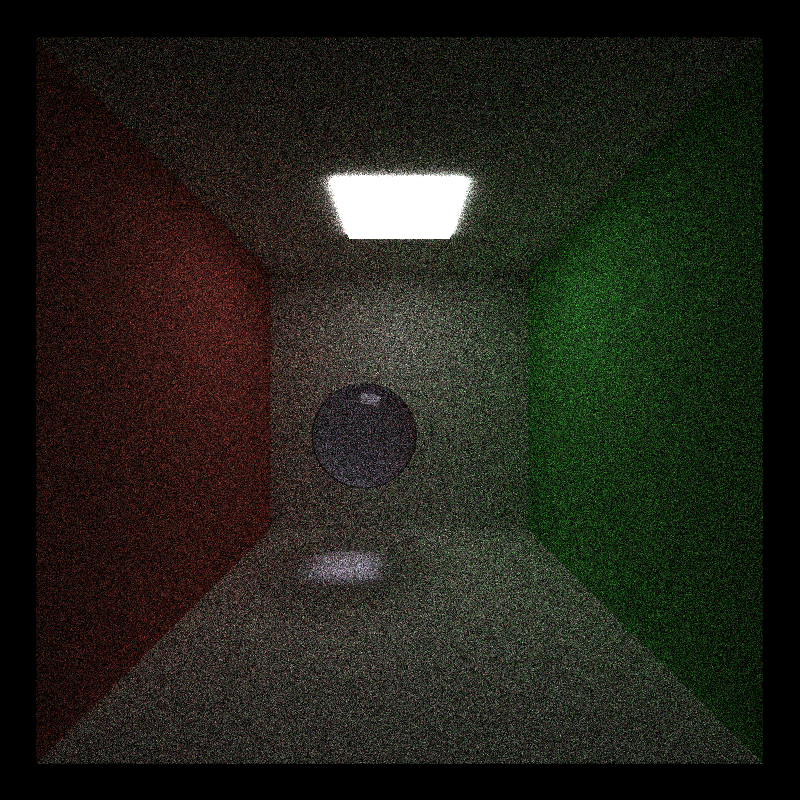
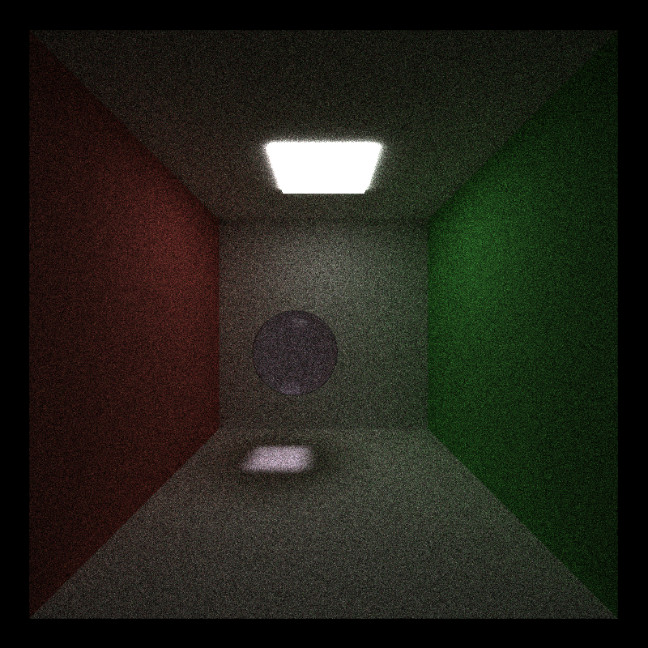
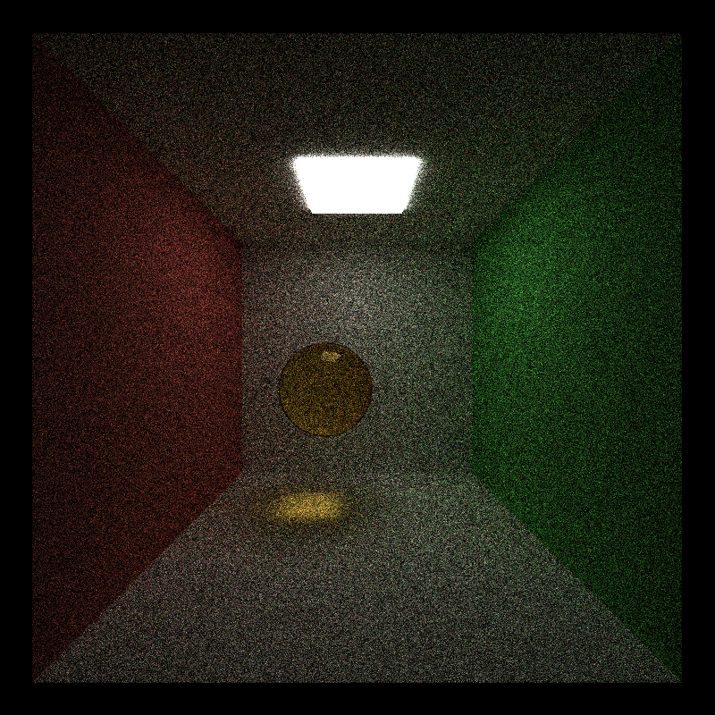
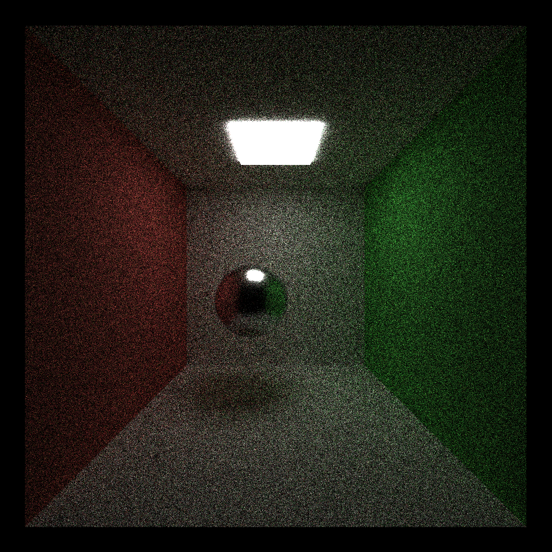
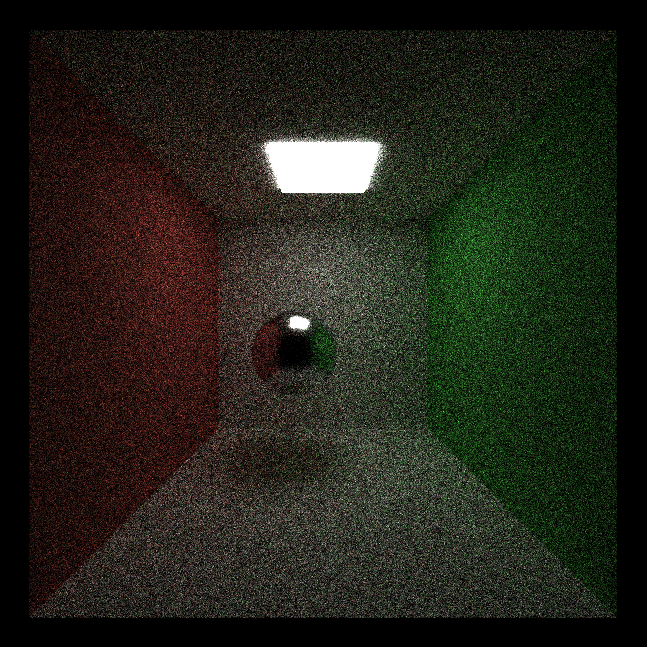
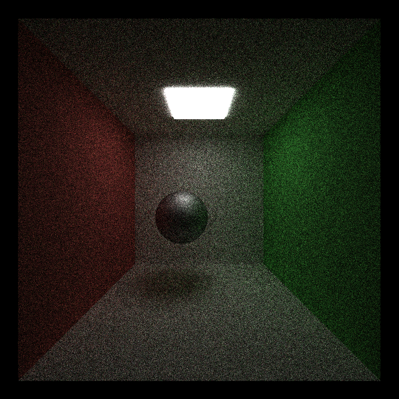

# CUDA Path Tracer

Rachel Lin

* [LinkedIn](https://www.linkedin.com/in/rachel-lin-452834213/)
* [personal website](https://www.artstation.com/rachellin4)
* [Instagram](https://www.instagram.com/lotus_crescent/)

Tested on: Windows 11, 12th Gen Intel(R) Core(TM) i7-12700H @ 2.30GHz, NVIDIA GeForce RTX 3080 Laptop GPU (16 GB)

## Overview

This is a basic Monte Carlo pathtracer implemented on the GPU using CUDA kernels. A ray is cast from each pixel on the screen, and is assigned a computation thread. Each "bounce" the pathtracer checks for intersections with the scene. Every time an intersection is detected, the ray either reflects (or refracts) into a new ray or gets terminated, and color is accumulated based on the material properties of the surface intersected.

Additional support is provided for refractive, specular, and diffuse shaders, as well as several common post-process filters and effects. Toggles are also provided for several optimization techniques to enhance performance.

A scene is represented in a JSON file containing information on the materials, mesh objects, and camera. The camera object also contains settings for the number of frames to iterate over and the maximum number of times a ray an bounce. You will find a few example scenes under the "scenes" folder.

## Features

* Basic pathtracing logic for diffuse shading
* Work-efficient stream compaction on rays
* Sorting rays by material
* Russian roulette path termination
* Stochastic sampled antialiasing
* Refractive materials
* Microfacet roughness
* Physically-based depth of field
* TODO: Mesh loading (obj, gltf)
* TODO: BVH acceleration
* TODO: Texture mapping
* TODO: Bump mapping
* TODO: Post-process bloom
* TODO: Post-process edge detection
* TODO: Post-process quantization
* TODO: Post-process pixelation
* TODO: Post-process anisotropic kuwahara filter

## Shading

### Diffuse 

On intersection with a diffuse surface, the ray simply accumulates its color multiplicatively.

### Refractive

| ior 1.0	| Roughness 1.25	| Roughness 1.5	|
| --------- | --------- | --------- |
|  |  |  |

Refractive materials use Snell's Law to compute the refracted ray angle (instead of the reflected ray). As it exits the object (intersecting with a backface), the ray either refracts on its way out, or it reflects back into the model, resulting in total internal reflection. The probability of reflection vs. refraction is calculated using the Fresnel-Schlick approximation.

#### References

[PBRTv4 9.3](https://pbr-book.org/4ed/Reflection_Models/Specular_Reflection_and_Transmission)
[PBRTv4 9.5](https://pbr-book.org/4ed/Reflection_Models/Specular_Reflection_and_Transmission)

### Specular

| Roughness 0	| Roughness 0.25	| Roughness 0.5	| Roughness 0.75	|
| --------- | --------- | --------- | --------- |
|  |  |  |  |

Specular materials are computed using the Cook-Torrance microfacet model. This implementation involves using the GGX distribution for computing microfacet self-shadowing and the Fresnel-Schlick approximation for reflections.

#### References

[PBRTv4 8.4](https://www.pbr-book.org/3ed-2018/Reflection_Models/Microfacet_Models)

## File Loading

### Custom Meshes

Both obj and glTF mesh loading is supported. Custom mesh objects have the TYPE "custom_gltf" or "custom_obj" in the scene JSON and have a PATH entry to store the location of the glTF/obj file. Note that glTF textures are not supported, with the intention being that textures are assigned via material in the scene JSON.

#### External Libraries

* [tiny\_obj](https://github.com/syoyo/tinyobjloader)
* [tiny\_gltf](https://github.com/syoyo/tinygltf/)

## Filters \& Post Processing

### Stochastic Sampled Antialiasing

The camera automatically applies a slight jitter to rays, helping to smooth out the final render.

### Physically-Based Depth of Field

Depth of field is automatically applied based on the "APERTURE" value of the camera in the scene JSON. Rays are jittered within the lens aperture to achieve this effect.

#### References

[PBRTv4 5.2.3](https://pbr-book.org/4ed/Cameras_and_Film/Projective_Camera_Models#TheThinLensModelandDepthofField)

## Optimizations

### Memory Coalescing

Path segments (rays) are sorted by material using the thrust library every bounce to make rays hitting the same material contiguous in memory. Since the GPU fetches contiguous blocks of memory from DRAM, having threads in a warp access consecutive addresses when possible allows memory reads to be combined into fewer memory reads, enabling the GPU to more efficiently perform memory coalescing. This feature can be toggled on by setting the ENABLE_SORTBYMATERIAL macro to 1.

### Work-Efficient Stream Compaction

Work-efficient stream compaction can be enabled by setting the ENABLE_STREAMCOMPACTION macro to 1, causing threads for dead rays to be culled. This implementation uses parallelized downsweep and upsweep steps to quickly compute an exclusive scan.

Testing on default cornell_diffuse.png:

| No stream compaction	| Work-efficient stream compaction	|
| --------- | --------- |
| application average: 652.573 ms/frame, 1.5 FPS | application average: 365.542 ms/frame, 2.7 FPS|

### Russian Roulette Path Termination

This optimization checks the color accumulated by a path so far and terminates it with a higher likelihood if the color is close to black and is unlikely to contribute a perceptible difference to the final render. This feature can be enabled by setting the ENABLE_RUSSIANROULETTETERMINATION macro to 1.

#### References

[PBRTv3 13.7](https://pbr-book.org/3ed-2018/Monte_Carlo_Integration/Russian_Roulette_and_Splitting)

